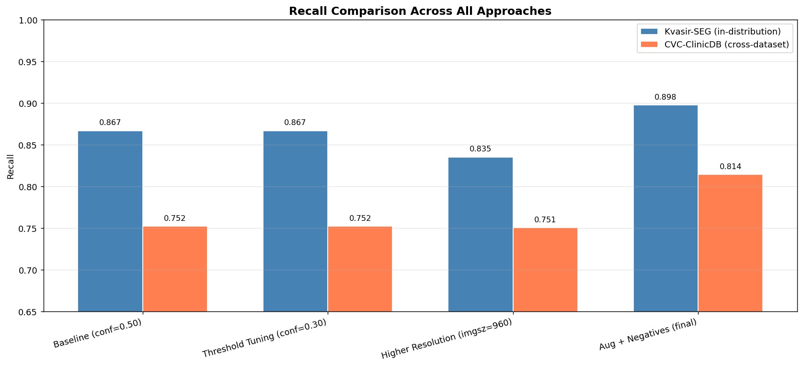
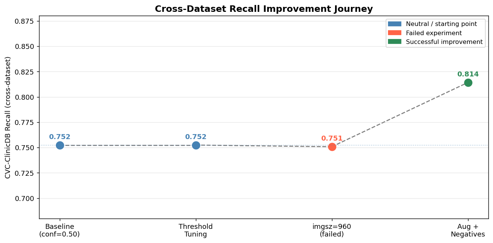
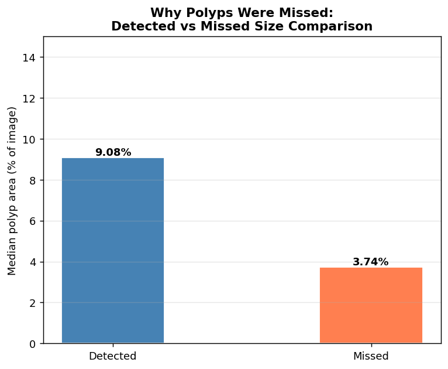
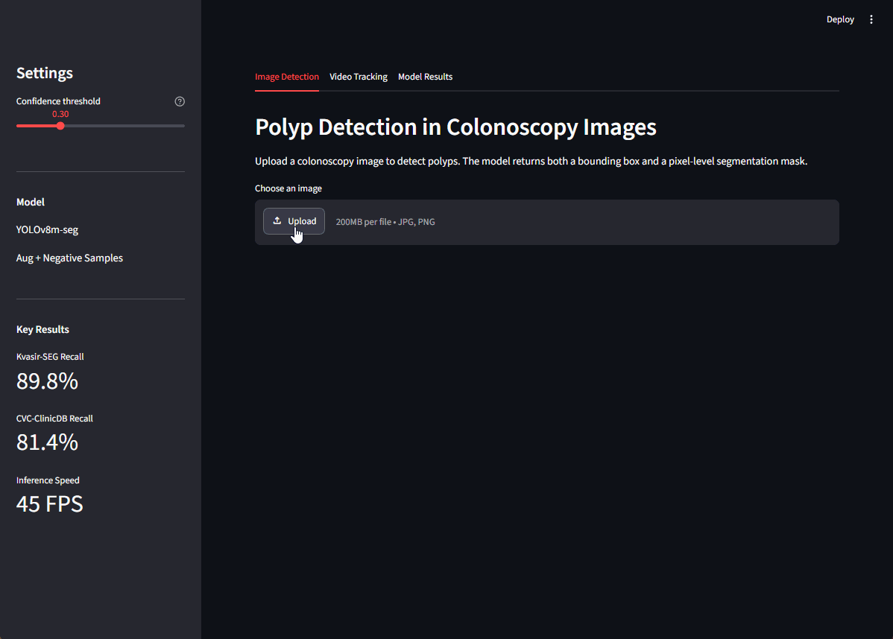
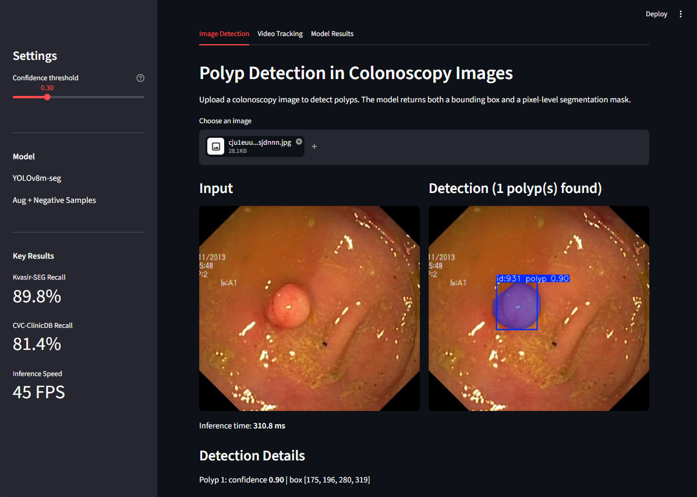
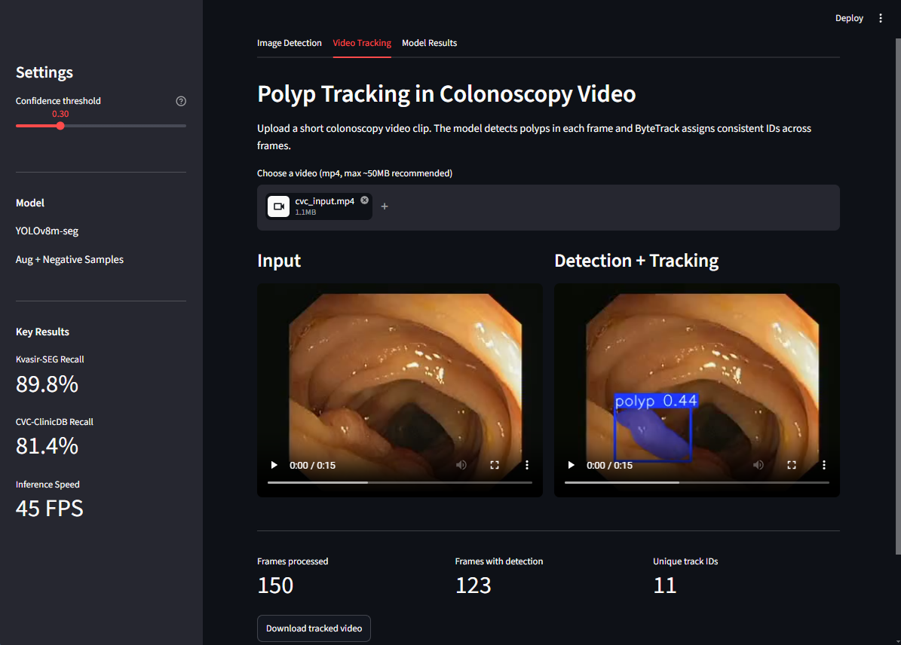

# 🔬 Real-Time Polyp Detection with Safety-First Approach

Deep learning system for automated polyp detection and tracking in colonoscopy images and videos, with a focus on minimizing missed detections over maximizing precision.

---

## 🎯 Project Overview

This project tackles polyp detection in colonoscopy images using YOLOv8m-seg with an instance segmentation approach. The core challenge: **cross-dataset generalization** — a model that performs well on its training distribution but fails on data from different hospitals or camera systems is not clinically useful.

**Approach:** A systematic engineering process — baseline training, error analysis, and evidence-based improvements — guided by published literature (YOLO-LAN, 2025).

### Key Results

| Metric | Baseline | Final Model | Change |
|--------|----------|-------------|--------|
| **Kvasir-SEG Recall** | 86.7% | **89.8%** | +3.1% |
| **CVC-ClinicDB Recall** | 75.2% | **81.4%** | +6.2% |
| **Inference Speed** | 45 FPS | 45 FPS | — |

> **Cross-dataset generalization:** The final model achieves 81.4% recall on CVC-ClinicDB, a dataset never seen during training (+6.2% over baseline).

---

## 📁 Datasets

| Dataset | Images | Role | Source |
|---------|--------|------|--------|
| **Kvasir-SEG** | 1,000 | Train / Val / Test | [simula.no](https://datasets.simula.no/kvasir-seg/) |
| **CVC-ClinicDB** | 612 | Cross-dataset evaluation only | [Kaggle](https://www.kaggle.com/datasets/balraj98/cvcclinicdb) |
| **Kvasir (normal)** | 140 sampled | Negative samples for training | [simula.no](https://datasets.simula.no/kvasir/) |

**Data split (Kvasir-SEG):** 70% train / 15% val / 15% test (stratified by polyp size)

> **Challenge:** Kvasir-SEG and CVC-ClinicDB come from different hospitals, cameras, and patient populations. A model that only generalizes within one dataset is not suitable for real-world deployment.

---

## 🧠 Model Architecture & Training

### Base Model
- **Architecture:** YOLOv8m-seg (Ultralytics)
- **Pretrained weights:** COCO
- **Input size:** 640×640
- **Task:** Instance segmentation (bounding box + pixel-level mask per polyp)

### Training Configuration
- **Optimizer:** AdamW (lr=0.001)
- **Epochs:** 100 (early stopping, patience=15)
- **Batch size:** 8
- **Mixed precision:** FP16 (AMP)
- **Augmentation:** flipud=0.5, degrees=45, hsv_s=0.9, hsv_v=0.5 (stronger than default)
- **Negative samples:** 140 polyp-free frames added to training split (20% ratio)

### Confidence Threshold
- **Operational threshold:** 0.30 (selected via sweep in notebook 04)
- Default YOLO threshold (0.50) leaves recall at plateau — lowering to 0.30 recovers missed detections without meaningful precision loss on in-distribution data.

---

## 📊 Evaluation Results

### Model Comparison

| Approach | Kvasir Recall | CVC Recall | Notes |
|----------|--------------|------------|-------|
| Baseline (conf=0.50) | 0.867 | 0.711 | Standard YOLOv8m-seg (Default threshold) |
| Threshold Tuning (conf=0.30) | 0.867 | 0.752 | Same model, optimized threshold |
| Higher Resolution (imgsz=960) | 0.835 | 0.751 | Retrain at 960px — did not improve |
| **Aug + Negatives (final)** | **0.898** | **0.814** | Stronger augmentation + 140 negative frames |

### 📈 Visualizations

**Recall Comparison Across All Approaches:**


**Cross-Dataset Recall Improvement Journey:**


**Why Polyps Were Missed — Size Analysis:**


---

## 🔍 Engineering Journey

This project followed a systematic diagnose → hypothesize → test → verify cycle:

### 1. Root Cause Analysis (Notebook 04b)
Error analysis on CVC-ClinicDB false negatives revealed that **missed polyps were 59% smaller (median area) than detected ones** — a small-object detection problem, not a brightness or position problem.

```
Detected polyps — median area: 9.08% of image
Missed polyps   — median area: 3.74% of image
```

### 2. Hypothesis 1: Higher Resolution (Notebook 04c)
Retrained at imgsz=960 with batch=4. **Result: no improvement** (miss rate increased from 11.3% to 14.1%). Conclusion: reducing batch size to fit the larger resolution hurt training stability more than the resolution gain helped.

### 3. Hypothesis 2: Augmentation + Negative Samples (Notebook 04d)
Following YOLO-LAN (2025), which reported +15.2% mAP50:95 on the same dataset using stronger augmentation and negative samples:

- Added `flipud=0.5`, `degrees=45`, `hsv_s=0.9` to augmentation
- Added 140 polyp-free frames from Kvasir (normal categories) to training split

**Result: CVC recall improved from 75.2% to 81.4% (+6.2 percentage points)**

---

## 🎥 Video Tracking

The final model supports real-time polyp tracking across video frames using ByteTrack, assigning consistent IDs to each polyp throughout the colonoscopy sequence.

**Demo — Detection + Tracking:**


**Tracking statistics on 150-frame CVC-ClinicDB sequence:**
- Detection rate: 84% of frames
- Inference speed: 45 FPS (RTX 4060)

---

## 🌐 Interactive Web Application

**Live Demo:** [Streamlit Cloud](https://polyp-detection-safety-first-q5eqnpanupvtr8j5dhckvf.streamlit.app/)

### Screenshots

**Image Detection:**


**Video Tracking:**



### Features
- Upload colonoscopy image → instant polyp detection with segmentation mask
- Upload video clip → per-frame detection + ByteTrack polyp tracking
- Adjustable confidence threshold (default: 0.30)
- Model performance comparison table with visualizations

### Run Locally

```bash
# Clone repository
git clone https://github.com/foroughm423/polyp-detection-safety-first.git
cd polyp-detection-safety-first

# Install dependencies
pip install -r requirements.txt

# Run app
streamlit run app/07_streamlit_app.py
```

> **Note:** The trained model weights are hosted privately on Hugging Face Hub. The live demo above uses secure token authentication via Streamlit Secrets — no setup needed to use the demo. To run locally with your own weights, place a `best.pt` file at `models/aug_neg/weights/best.pt` (trained using the notebooks in this repo) and update `MODEL_PATH` in `07_streamlit_app.py` accordingly.

---

## 📂 Repository Structure

```
polyp-detection-safety-first/
├── README.md
├── requirements.txt
├── .gitignore
│
├── app/
│   └── 07_streamlit_app.py         # Streamlit web application
│
├── notebooks/
│   ├── 01_data_exploration.ipynb
│   ├── 02_data_preparation.ipynb
│   ├── 03_baseline_training.ipynb
│   ├── 04_safety_first_training.ipynb
│   ├── 04b_error_analysis.ipynb
│   ├── 04c_imgsz_retrain.ipynb
│   ├── 04d_augmentation_negatives.ipynb
│   ├── 05_final_evaluation.ipynb
│   └── 06_video_tracking.ipynb
│
├── configs/
│   ├── dataset.yaml
│   ├── dataset_aug_neg.yaml
│   └── dataset_cvc_eval.yaml
│
└── results/
    ├── figures/
    │   ├── final_comparison.png
    │   ├── recall_progression.png
    │   ├── error_analysis_summary.png
    │   ├── error_analysis_missed_samples.png
    │   └── tracking_detections.png
    └── metrics/
        ├── baseline_metrics.json
        ├── safety_first_metrics.json
        ├── aug_neg_metrics.json
        └── final_summary.json
```

---

## 🛠️ Technologies

- **Python 3.10+**
- **PyTorch 2.6** + CUDA 12.4
- **YOLOv8m-seg** (Ultralytics)
- **ByteTrack** (multi-object tracking)
- **OpenCV** (video processing)
- **Streamlit** (web deployment)
- **Hugging Face Hub** (secure model hosting)

---

## 🚀 Future Improvements

- [ ] Test on additional colonoscopy datasets (SUN-SEG, ETIS-Larib)
- [ ] Experiment with YOLOv9 or YOLOv10 architectures
- [ ] Add Grad-CAM visualizations for model interpretability
- [ ] Fine-tune on combined Kvasir-SEG + CVC-ClinicDB for better generalization
- [ ] Deploy mobile-friendly version

---

## 📖 References

1. [Kvasir-SEG Dataset](https://arxiv.org/abs/1911.07069) — Jha et al., 2020
2. [CVC-ClinicDB Dataset](https://doi.org/10.1016/j.compmedimag.2015.02.007) — Bernal et al., 2015
3. [YOLOv8](https://github.com/ultralytics/ultralytics) — Ultralytics, 2023
4. [ByteTrack](https://arxiv.org/abs/2110.06864) — Zhang et al., 2022
5. YOLO-LAN — augmentation + negative samples methodology, 2025

---

## 🔗 Links

- **Live Demo:** [Streamlit Cloud](https://polyp-detection-safety-first-q5eqnpanupvtr8j5dhckvf.streamlit.app/)
- **Source Code:** [GitHub](https://github.com/foroughm423/polyp-detection-safety-first)
- **Training Notebooks (with outputs):**
  - [01 — Data Exploration](https://www.kaggle.com/code/foroughgh95/polyp-detection-01-data-exploration)
  - [03 — Baseline Training](https://www.kaggle.com/code/foroughgh95/polyp-detection-03-baseline-training)
  - [04 — Safety-First Training](https://www.kaggle.com/code/foroughgh95/polyp-detection-04-safety-first)
  - [04b — Error Analysis](https://www.kaggle.com/code/foroughgh95/polyp-detection-04b-error-analysis)
  - [05 — Final Evaluation](https://www.kaggle.com/code/foroughgh95/polyp-detection-05-final-evaluation)

---

## ⚖️ License

This project is licensed under the MIT License. See [LICENSE](LICENSE) for details.

---

## 👩‍💻 Author

**Forough Ghayyem**
📫 [GitHub](https://github.com/foroughm423) | [LinkedIn](https://www.linkedin.com/in/forough-ghayyem/) | [Kaggle](https://www.kaggle.com/foroughgh95)

---

## 🙏 Acknowledgments

- Kvasir-SEG dataset: SimulaMet, Oslo
- CVC-ClinicDB dataset: Computer Vision Center, Barcelona
- Model hosting: Hugging Face Hub

---

> ⚠️ **Medical Disclaimer:** This model is for research and educational purposes only. It should not be used as a substitute for professional medical diagnosis. Always consult a qualified gastroenterologist for proper evaluation of colonoscopy findings.
```

---

